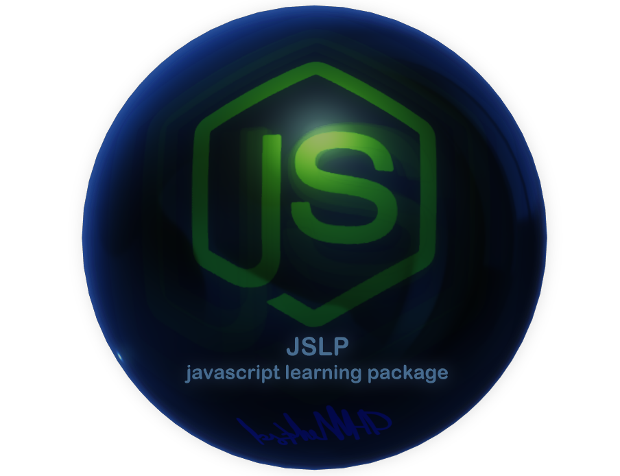

In the name of ALLAH

Author:  seyed mahdi mahdavi mortazavi (theMHD)
# JSLP-javascript-learning-package

    Learning javascript with the javascript codes :)
    This package contains three chpters, six sections and fifteen parts.

    Contents:
        Chapter 1: Basics of javascript (like another programming languages);
            Section 1: data types, operators and conditional states;
            Section 2: functions, loops, events and try-catch;
        Chapter 2: Special and advanced contents of javascript;
            Section 3: DOM tree (DOM definition and DOM modification);
            Section 4: JS Objects - String and Date;
            Section 5: JS Objects - Array and Math;
            Section 6: JS Objects - Regular expressions (regex) and Window;
        Chapter 3: Some good practices :);
            After finishing the chapters 1&2, you can check this practices;

    Prerequisites:
        Familiarity with:
            - HTML
            - Fundamental of computer and programming
        Better to be familiar with:
            - CSS
            - Basics of a programming language

||| JSLP - by theMHD |||
